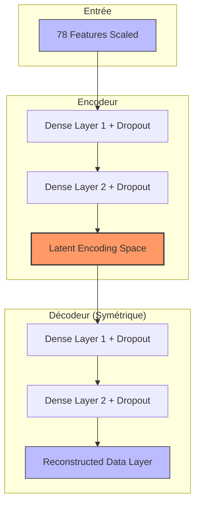

# Diagramme d'Architecture de l'Autoencoder

```mermaid
graph TD
    subgraph Input ["Entrée"]
        IN[78 Features Scaled]
    end

    subgraph Encoder ["Encodeur"]
        E1[Dense Layer 1 + Dropout]
        E2[Dense Layer 2 + Dropout]
        LAT[Latent Encoding Space]
    end

    subgraph Decoder ["Décodeur (Symétrique)"]
        D1[Dense Layer 1 + Dropout]
        D2[Dense Layer 2 + Dropout]
        OUT[Reconstructed Data Layer]
    end

    IN --> E1
    E1 --> E2
    E2 --> LAT
    LAT --> D1
    D1 --> D2
    D2 --> OUT

    style LAT fill:#f96,stroke:#333,stroke-width:2px
    style IN fill:#bbf,stroke:#333
    style OUT fill:#bbf,stroke:#333
```
