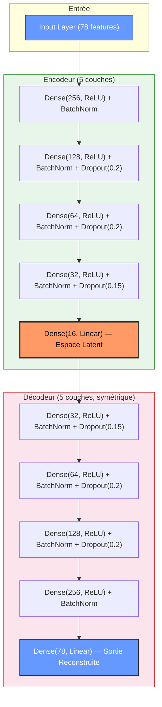
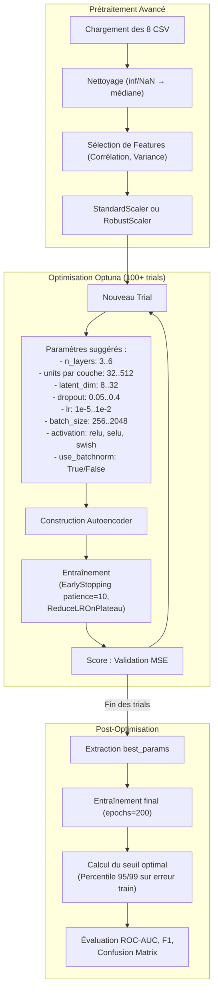

# Architecture Optimisée & Explications du Projet de Détection d'Anomalies Réseau

## 1. Pourquoi l'Encodeur est-il « réduit » ?

Le principe fondamental d'un **Autoencoder** repose sur une compression progressive de l'information. L'encodeur réduit la dimensionnalité des données d'entrée (78 features) vers un **espace latent** beaucoup plus petit (ex. ~15 neurones). Cette réduction est **intentionnelle et essentielle** pour les raisons suivantes :

### 1.1 Forcer l'apprentissage de représentations essentielles
En comprimant 78 features vers ~15 dimensions, on force le réseau à **ne conserver que les caractéristiques les plus significatives** du trafic normal (BENIGN). Les redondances et le bruit sont éliminés. C'est exactement ce mécanisme qui permet la détection d'anomalies : le modèle apprend à reconstruire **uniquement** le trafic normal avec fidélité.

### 1.2 Créer un "goulot d'étranglement" (bottleneck)
L'espace latent réduit agit comme un goulot d'étranglement informationnel. Quand un flux réseau **anormal** (attaque) traverse l'Autoencoder, il ne peut pas être correctement reconstruit car ses caractéristiques n'ont jamais été apprises. L'erreur de reconstruction (MSE) sera alors **élevée**, ce qui constitue le signal de détection.

### 1.3 Contrainte vs. capacité
- **Trop de neurones dans l'espace latent** → le modèle apprend une fonction identité (copie les données sans les comprimer), perdant toute capacité discriminante.
- **Trop peu de neurones** → la reconstruction même du trafic normal est trop dégradée, générant trop de faux positifs.
- L'optimisation Optuna trouve le **juste milieu** entre ces deux extrêmes.

---

## 2. Commentaires sur le Pipeline Existant

### 2.1 Chargement & Fusion des Données
- **8 fichiers CSV** du dataset **CIC-IDS2017** sont chargés et fusionnés.
- Le dataset total fait **2 830 743 lignes × 79 colonnes** (78 features + 1 label).
- La colonne `Label` distingue le trafic `BENIGN` de 14 types d'attaques.

### 2.2 Prétraitement
- **Séparation Train/Test** : l'entraînement se fait **uniquement sur les données BENIGN** (approche non supervisée). Le test utilise l'ensemble complet.
- **Nettoyage** : les valeurs `inf`/`-inf` sont remplacées par `NaN`, puis comblées par la **médiane** de chaque colonne (robuste aux outliers).
- **Normalisation MinMaxScaler** : ramène toutes les features dans l'intervalle `[0, 1]`, indispensable pour la convergence des réseaux de neurones.

### 2.3 Modèle Actuel (simplifié par contraintes)
Le modèle final, après optimisation Optuna avec seulement 2 couches dans l'encodeur, est :

```
Input(78) → Dense(enc_1) → Dropout → Dense(enc_2) → Dropout → Latent(~15) → Dense(dec_1) → Dropout → Dense(dec_2) → Dropout → Output(78)
```

> [!NOTE]
> Ce modèle à **2 couches** par côté (encodeur et décodeur) a été retenu en raison des **contraintes de temps d'exécution et de hardware** (GPU Kaggle Tesla T4 avec limite de temps). Il offre un bon compromis performance/coût.

### 2.4 Optimisation Optuna (exécutée)
- **20 trials** effectués.
- Paramètres explorés : `dropout_rate`, `activation`, `learning_rate`, `encoder_units_layer_1`, `encoder_units_layer_2`, `latent_dim`.
- **Meilleur trial** (trial 3) : validation loss de `4.12e-05`.

---

## 3. Architecture Idéale Optimisée (Non Exécutable)

Si les contraintes de **temps** et de **hardware** étaient levées (ex. GPU V100/A100, pas de limite de session), voici l'architecture recommandée.

### 3.1 Diagramme de l'Architecture Idéale



### 3.2 Pipeline d'Optimisation Idéal



### 3.3 Améliorations Clés par rapport au modèle actuel

| Aspect | Modèle Actuel | Architecture Idéale |
| :--- | :--- | :--- |
| **Couches Encodeur** | 2 | 4-5 |
| **Couches Décodeur** | 2 | 4-5 (symétrique) |
| **BatchNormalization** | Non | Oui (stabilise l'apprentissage) |
| **Nombre de Trials Optuna** | 20 | 100-200 |
| **Espace de recherche** | Fixe (relu seul) | Élargi (relu, selu, swish) |
| **Batch Size** | Non optimisé | Optimisé (256-2048) |
| **Scaler** | MinMaxScaler | RobustScaler ou StandardScaler |
| **Sélection de Features** | Non | Oui (suppression features corrélées/constantes) |
| **Callbacks** | EarlyStopping | EarlyStopping + ReduceLROnPlateau |
| **Epochs max** | Limité | 200+ avec EarlyStopping |
| **Seuil de détection** | Kmeans / Manuel | Percentile statistique sur l'erreur de reconstruction |

> [!IMPORTANT]
> L'architecture idéale nécessiterait un GPU haut de gamme (A100/V100) et plusieurs heures d'optimisation Optuna. Sur le hardware Kaggle actuel (Tesla T4, session limitée), seule la version simplifiée à 2 couches est réalisable.

### 3.4 Justification de la Profondeur Accrue

Une architecture plus profonde (5 couches encodeur / 5 couches décodeur) permet :

1. **Extraction hiérarchique** : chaque couche capture un niveau d'abstraction différent des flux réseau.
2. **Meilleure généralisation** : avec `BatchNormalization` et `Dropout`, le modèle évite le surapprentissage même avec plus de paramètres.
3. **Compression plus progressive** : passer de 78 → 256 → 128 → 64 → 32 → 16 est beaucoup plus doux que 78 → 128 → 15, ce qui préserve davantage d'information utile.
4. **Détection plus fine** : une meilleure reconstruction du trafic normal entraîne une meilleure discrimination des anomalies.
