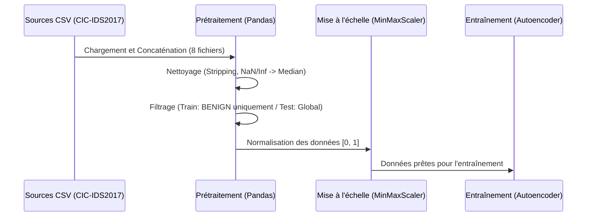

# Diagramme du Pipeline de Traitement des Données

```mermaid
sequenceDiagram
    participant D as Sources CSV (CIC-IDS2017)
    participant P as Prétraitement (Pandas)
    participant S as Mise à l'échelle (MinMaxScaler)
    participant M as Entraînement (Autoencoder)

    D->>P: Chargement et Concaténation (8 fichiers)
    P->>P: Nettoyage (Stripping, NaN/Inf -> Median)
    P->>P: Filtrage (Train: BENIGN uniquement / Test: Global)
    P->>S: Normalisation des données [0, 1]
    S->>M: Données prêtes pour l'entraînement
```
